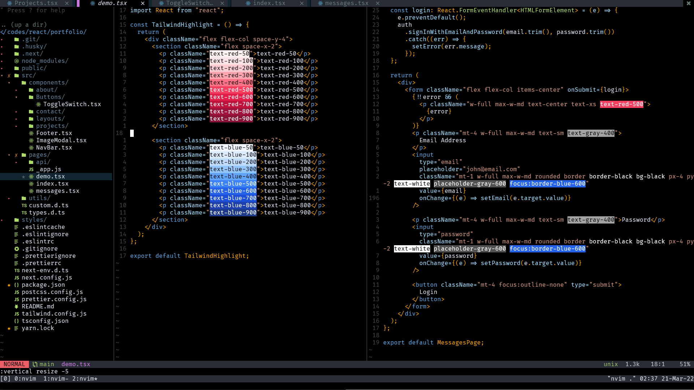

# tailwind-highlight.nvim


Highlight [Tailwind CSS](https://tailwindcss.com/) classes in [neovim](https://neovim.io/)

> "The neovim plugin [used](https://github.com/bautistaaa/dotfiles/blob/d53f8d0fe4b226e90bcbfcecc8ceea6a270ccd1c/nvim/lua/trash/plugins.lua#L65) by a Netflix Engineer"

<!--  -->


## Installation

- **[Vim Plug](https://github.com/junegunn/vim-plug)**

  ```vim
  " required dependency
  Plug 'neovim/nvim-lspconfig'
  " (optional) for installing tailwindcss language server
  Plug 'williamboman/nvim-lsp-installer'
  Plug 'princejoogie/tailwind-highlight.nvim'
  ```

- **[Vundle](https://github.com/VundleVim/Vundle.vim)**

  ```vim
  " required dependency
  Plugin 'neovim/nvim-lspconfig'
  " (optional) for installing tailwindcss language server
  Plugin 'williamboman/nvim-lsp-installer'
  Plugin 'princejoogie/tailwind-highlight.nvim'
  ```

- **[Dein](https://github.com/Shougo/dein.vim)**
  ```vim
  " required dependency
  call dein#add('neovim/nvim-lspconfig')
  " (optional) for installing tailwindcss language server
  call dein#add('williamboman/nvim-lsp-installer')
  call dein#add('princejoogie/tailwind-highlight.nvim')
  ```

## Usage

```lua
local tw_highlight = require('tailwind-highlight')
```

#### Methods

| Method  | Args                    | Returns  |
| ------- | ----------------------- | -------- |
| `setup` | `(client, bufnr, opts)` | `void`   |
| `ping`  | `N/A`                   | `string` |

#### Setup Options

| Option          | Description                               |      Default |
| --------------- | ----------------------------------------- | -----------: |
| `single_column` | highlight only first character            |      `false` |
| `mode`          | highlight mode `foreground \| background` | `background` |
| `debounce`      | delay on updating highlights (ms)         |        `200` |

#### Without Lsp Installer

> Manually install [tailwindcss-language-server](https://www.npmjs.com/package/@tailwindcss/language-server)

```lua
require('lspconfig').tailwindcss.setup({
  on_attach = function(client, bufnr)
    -- rest of you config
    tw_highlight.setup(client, bufnr, {
      single_column = false,
      mode = 'background',
      debounce = 200,
    })
  end
})
```

#### With Lsp Installer

> `:LspInstall tailwindcss`

```lua

require('nvim-lsp-installer').on_server_ready(function(server)
  local opts = {
    on_attach = function(client, bufnr)
      -- rest of you config
      tw_highlight.setup(client, bufnr, {
        single_column = false,
        mode = 'background',
        debounce = 200,
      })
    end
  }

  server:setup(opts)
end)
```

---

Like the project? would appreciate a coffee ☕

[](https://www.buymeacoffee.com/princejoogie)

### Contributor list

[](https://github.com/princejoogie/tailwind-highlight.nvim/graphs/contributors)

---

Made with ☕ by [Prince Carlo Juguilon][portfolio]

[portfolio]: https://princecaarlo.tech/
[github]: https://github.com/princejoogie/
[twitter]: https://twitter.com/princecaarlo/
[instagram]: https://www.instagram.com/princecaarlo/
[linkedin]: https://www.linkedin.com/in/princejoogie/
